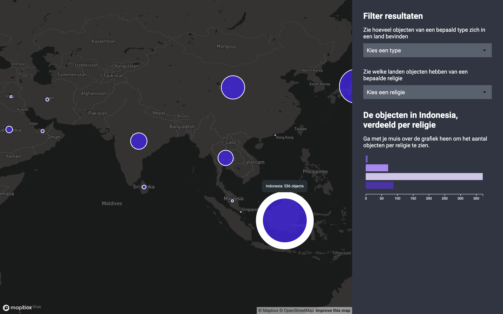

# NVMW mappd
[](https://app.netlify.com/sites/frontend-data-kris-kuiper/deploys)

> A filterable map of the cultural heritage of the NMVW collection



## Installation
`Src/app.js` gets bundled to `public/scripts/bundle.js`, public folder gets served from Netlify.

```bash
# Clone the repo
git clone https://github.com/kriskuiper/frontend-data.git

# Install dependencies
npm install

# Bundle and watch src/app.js
npm run dev

# Bundle and build
npm run build
```

## Data flow
Something about the data flow

## Acknowlegdements
Some people probably are going to deserve some creds
